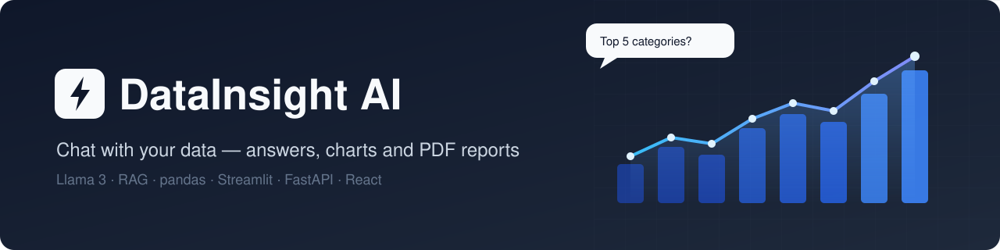
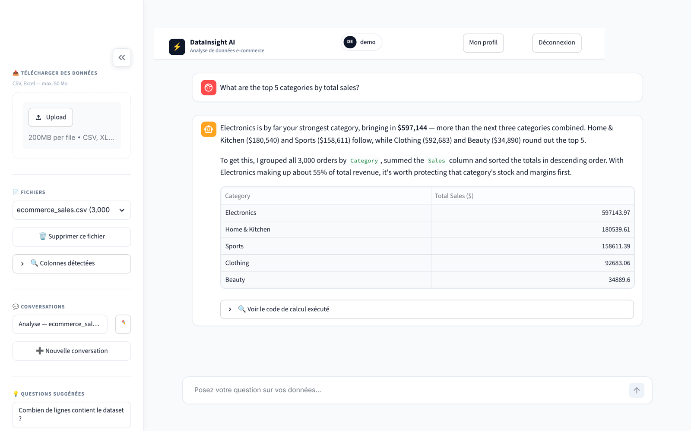
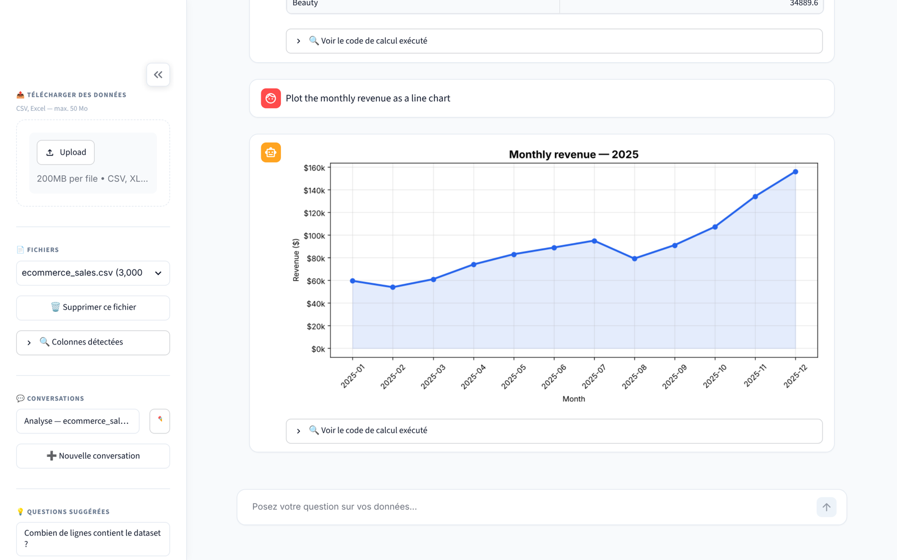
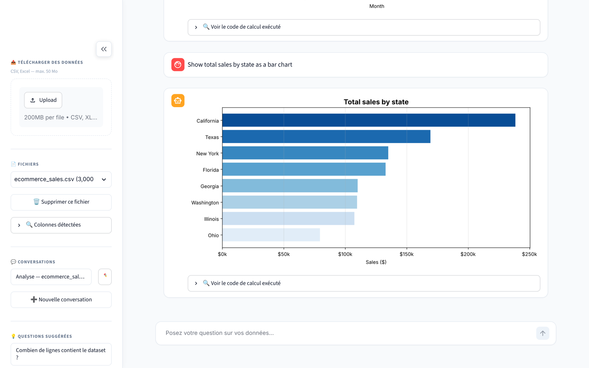
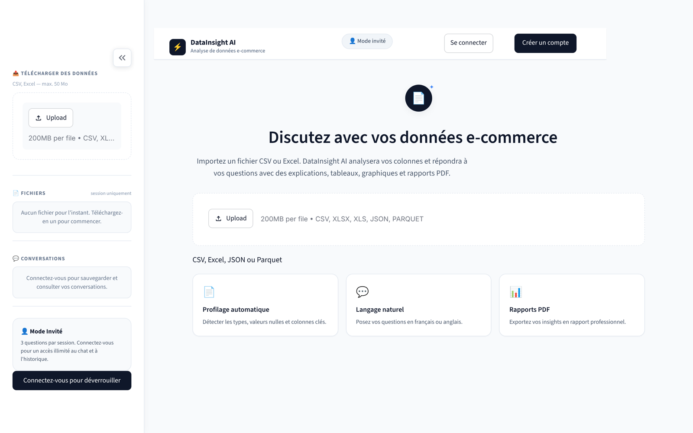
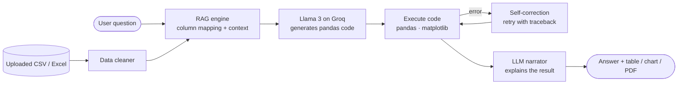

<p align="center">
  
</p>

<p align="center">
  <b>Chat with your data.</b> Upload a CSV or Excel file, ask questions in plain language, and get answers, charts and PDF reports.<br>
  Powered by Llama 3 (via Groq) and a lightweight RAG layer tuned for e-commerce datasets.
</p>

<p align="center">
  <a href="https://github.com/axhraf40/datainsightAI/actions/workflows/ci.yml"></a>
  
  
  
  
  
  <a href="LICENSE"></a>
</p>

<p align="center">
  <a href="#-demo">Demo</a> •
  <a href="#-features">Features</a> •
  <a href="#-how-it-works">How it works</a> •
  <a href="#-getting-started">Getting started</a> •
  <a href="#-project-structure">Structure</a> •
  <a href="#-roadmap">Roadmap</a>
</p>

---

## 🎬 Demo

<p align="center">
  
</p>

<p align="center"><sub>Sign up → upload <code>sample_data/ecommerce_sales.csv</code> → ask questions → get answers, tables and charts.</sub></p>

## 📸 Screenshots

<table>
  <tr>
    <td width="50%"><p align="center"><sub><b>Natural-language answer + result table</b></sub></p></td>
    <td width="50%"><p align="center"><sub><b>Auto-generated time-series chart</b></sub></p></td>
  </tr>
  <tr>
    <td width="50%"><p align="center"><sub><b>Category breakdown chart</b></sub></p></td>
    <td width="50%"><p align="center"><sub><b>Landing page (guest mode)</b></sub></p></td>
  </tr>
</table>

> The interface is in French; you can ask questions in **English or French** and the assistant answers in the same language.

## ✨ Features

| | |
|---|---|
| 💬 **Natural-language analysis** | Questions are turned into pandas code by the LLM, executed, then explained back in plain language. The generated code is always viewable. |
| 🧠 **Adaptive e-commerce RAG** | On upload, columns are semantically mapped (category, region, gender, shipping, date, amount…) against a knowledge base. That context is injected into the prompt, and suggested questions are generated for each dataset. |
| 📊 **Automatic charts** | matplotlib / seaborn visualizations whenever a question calls for one. |
| 📄 **PDF reports** | One-click executive summary with key insights (ReportLab). |
| 🧹 **Automatic data cleaning** | Type inference, missing values, duplicates — with a cleaning report. |
| 🔁 **Model fallback chain** | Automatically switches Groq models on rate limits (429) or deprecated models. |
| 🔐 **User accounts** | Sign up, log in, password reset, bcrypt-hashed passwords, browser-bound sessions. Guest mode with a limited number of questions. |
| 🗂️ **Per-user workspace** | Datasets, conversations and generated charts are saved per user in SQLite. |
| 🖥️ **Two front-ends** | A Streamlit app, plus an optional React + TypeScript UI backed by a FastAPI REST API. |

## 🔍 How it works



1. **Profile** — the uploaded file is cleaned and its columns are matched to e-commerce concepts from `rag/knowledge_base.json`.
2. **Generate** — the question, dataset schema, sample rows and RAG context are sent to Llama 3, which returns pandas code.
3. **Execute** — the code runs in a controlled namespace that exposes only the data and pandas, NumPy, matplotlib and seaborn. If it fails, the error is fed back to the model to fix it.
4. **Explain** — the raw result is passed to a second LLM call that writes a short, human answer in the user's language.

## 🛠️ Tech stack

| Layer | Tools |
|---|---|
| LLM | Groq API — `llama-3.3-70b-versatile`, `llama-3.1-8b-instant` (with fallback) |
| Data | pandas, NumPy, scikit-learn, openpyxl |
| Visualization | matplotlib, seaborn |
| Web UI | Streamlit · React, TypeScript, TanStack Router, Tailwind CSS, shadcn/ui |
| Backend API | FastAPI, Uvicorn |
| Storage & auth | SQLite, bcrypt |
| Reports | ReportLab |
| Quality | pytest, Ruff, GitHub Actions |

## 🚀 Getting started

### Prerequisites

- Python 3.11+
- A free Groq API key → [console.groq.com/keys](https://console.groq.com/keys)

### 1. Clone and install

```bash
git clone https://github.com/axhraf40/datainsightAI.git
cd datainsightAI
python -m venv .venv
source .venv/bin/activate        # Windows: .venv\Scripts\activate
pip install -r requirements.txt
```

### 2. Add your API key

```bash
cp .env.example .env             # Windows: copy .env.example .env
# then edit .env and set GROQ_API_KEY
```

### 3. Run

```bash
streamlit run app.py
```

Open http://localhost:8501, create an account, upload `sample_data/ecommerce_sales.csv` and try:

- *"What are the top 5 categories by total sales?"*
- *"Plot the monthly revenue as a line chart"*
- *"Show total sales by state as a bar chart"*
- *"Compare average order value between men and women"*
- *"Generate a PDF report of this dataset"*

### Optional: React frontend + FastAPI

```bash
# terminal 1 — REST API on :8000
uvicorn api:app --reload --port 8000

# terminal 2 — frontend (proxies /api to :8000)
cd frontend
bun install        # or: npm install
bun run dev        # or: npm run dev
```

Interactive API docs are available at http://localhost:8000/docs.

### Running the tests

```bash
pip install pytest ruff
ruff check --select E9,F63,F7,F82 .
pytest -q
```

## 📁 Project structure

```
├── app.py               # Streamlit UI
├── api.py               # FastAPI REST backend (for the React UI)
├── data_analyst.py      # LLM engine: code generation, execution, self-correction, narration
├── data_cleaner.py      # Automatic dataset cleaning
├── dataset_loader.py    # CSV / Excel / JSON / Parquet loading
├── pdf_report.py        # PDF report generation
├── auth.py              # Sign up / login / logout / password reset
├── browser_auth.py      # Browser-bound session cookie
├── database.py          # SQLite schema and queries
├── ui_styles.py         # Streamlit custom styling
├── rag/
│   ├── knowledge_base.json  # E-commerce semantic knowledge base
│   └── rag_engine.py        # Column mapping + suggested questions
├── sample_data/         # Synthetic e-commerce dataset to try the app
├── tests/               # pytest suite (no API key needed)
├── frontend/            # Optional React + TypeScript UI
├── assets/              # README banner, screenshots, demo GIF
└── .github/             # CI workflow, issue & PR templates
```

The SQLite database is created automatically in `data/app.db` on first run (git-ignored).

## 🗺️ Roadmap

- [ ] English version of the interface (i18n)
- [ ] Docker image and one-click deploy (Streamlit Community Cloud / Render)
- [ ] Sandboxed code execution in a separate process
- [ ] Support for more LLM providers (OpenAI, local models via Ollama)
- [ ] Email delivery for password-reset codes

## 🔒 Security notes

- API keys are read from environment variables only — `.env` is git-ignored.
- Passwords are hashed with bcrypt; sessions are bound to the browser.
- In development mode, the password-reset code is displayed on screen instead of being emailed.

## 🤝 Contributing

Contributions are welcome — see [CONTRIBUTING.md](CONTRIBUTING.md).

## 📄 License

Released under the [MIT License](LICENSE).

## 👤 Author

**Achraf Bouhmala** — [@axhraf40](https://github.com/axhraf40)

If you find this project useful, consider giving it a ⭐!
